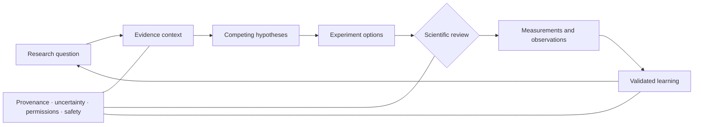

# Agentic Digital Wet Lab AI

> A public, high-level product vision for human-governed AI that connects multimodal biological evidence, competing hypotheses, experiment design, and traceable scientific learning.

**Status:** Private R&D initiative · Public concept overview · Pre-release · Not a deployed laboratory, clinical, or diagnostic system

## Vision

Biomedical research is not a straight path from data to answer. Scientists move repeatedly between observations, prior evidence, alternative explanations, experimental choices, measurements, and revision.

The vision for this initiative is an **agentic digital wet lab** that helps qualified researchers navigate that cycle with greater continuity, rigor, and transparency. Bounded AI assistance can organize scientific context, compare plausible explanations, surface uncertainty, structure testable questions, and prepare reviewable experiment options—while scientists retain control over interpretation, execution, and conclusions.

The objective is not to replace physical experiments or scientific judgment. It is to make the reasoning around experiments more explicit, evidence-linked, and reusable.

## The Opportunity

Modern research teams work across literature, omics, imaging, assay results, protocols, notebooks, and computational analyses. Important context is often fragmented across formats, systems, and projects. That fragmentation makes it difficult to understand why an experiment was selected, which evidence supported it, what assumptions were made, and how a result changed the underlying hypothesis.

This product direction addresses that gap through:

- multimodal evidence context rather than isolated data views;
- competing hypotheses rather than a single generated answer;
- experiment planning based on information value, feasibility, and uncertainty;
- explicit scientific review and approval points;
- traceable links among sources, assumptions, measurements, and conclusions; and
- research memory that preserves both positive and negative learning.

## Planned Product Domains

The capabilities below are development targets, not claims of released, validated, or production-ready functionality.

| Domain | Intended support |
|---|---|
| **Research-question framing** | Convert broad scientific objectives into bounded questions, testable hypotheses, decision criteria, and explicit unknowns for researcher review. |
| **Multimodal evidence intelligence** | Connect relevant literature, omics, imaging, assay, and experimental context while preserving source, version, cohort, and quality information. |
| **Biological-state reasoning** | Compare observed and predicted biological states across conditions, time points, and contexts without presenting model outputs as experimental fact. |
| **Perturbation intelligence** | Organize evidence about how biological systems may respond to controlled perturbations; distinguish observed effects, model estimates, and unsupported extrapolation. |
| **Causal hypothesis mapping** | Represent competing mechanisms, supporting and contradicting evidence, confounders, mediators, and discriminating experiments. |
| **Experiment-design assistance** | Prepare reviewable options covering variables, controls, endpoints, replication, randomization, feasibility, and expected information gain. |
| **Measurement and result interpretation** | Compare observations with preregistered expectations, identify contradictions and batch effects, and propose qualified follow-up questions. |
| **Research provenance and reproducibility** | Preserve data lineage, transformations, model versions, protocol context, human decisions, and superseded interpretations. |
| **Portfolio learning** | Connect validated findings, failed hypotheses, unresolved uncertainty, and evidence gaps across programs without erasing local experimental context. |

## Conceptual Scientific Learning Loop

This diagram communicates a scientific decision pattern, not a technical architecture or autonomous laboratory workflow.

## What Makes the Direction Different

- **Alternatives before answers:** the workspace maintains competing explanations and the evidence that could distinguish among them.
- **Experiments as information decisions:** candidate experiments are compared by expected learning, scientific validity, feasibility, cost, and risk—not novelty alone.
- **Observed, inferred, and predicted remain distinct:** measured facts, statistical estimates, model outputs, and human conclusions are never collapsed into one claim.
- **Multimodal, but context-preserving:** evidence can be connected across modalities without hiding cohort, assay, batch, resolution, or generalization limits.
- **Uncertainty drives action:** weak support, disagreement, missing controls, and out-of-distribution conditions trigger abstention, clarification, or escalation.
- **Negative results remain valuable:** failed or inconclusive experiments become structured evidence rather than disappearing from institutional memory.
- **Human accountability:** qualified scientists authorize experiments, interpret results, and own consequential decisions.

## Trust by Design

The target operating model is guided by the following principles:

1. **Defined context of use** — every workflow has a documented scientific purpose, user, data boundary, output type, and consequence.
2. **Evidence lineage** — claims remain connected to sources, samples, conditions, transformations, versions, and relevant limitations.
3. **Hypothesis discipline** — alternatives, assumptions, falsification criteria, and unresolved questions remain visible.
4. **Calibration and abstention** — confidence is evaluated; insufficient or unfamiliar evidence triggers a qualified non-answer or review.
5. **Reproducibility** — inputs, analysis choices, protocols, model versions, and human decisions are recorded at an appropriate level.
6. **Data rights and minimization** — access, consent, licensing, privacy, and permitted use are enforced before analysis.
7. **Scientific and biosafety review** — proposed activities remain within authorized, ethically appropriate, and risk-assessed research boundaries.
8. **Lifecycle evaluation** — evidence fidelity, robustness, drift, failure modes, user reliance, and downstream impact are monitored over time.

## North-Star Roadmap

This roadmap describes intended capability progression. It is not a release schedule or statement of present functionality.

### 1. Evidence and provenance foundation

- Research-object identity and version-aware evidence records
- Multimodal metadata, quality context, and rights-aware access
- Source-to-claim lineage and evidence-aging awareness
- Controlled benchmark and synthetic evaluation environments

### 2. Hypothesis and mechanism workspace

- Bounded research-question decomposition
- Competing-hypothesis and contradiction mapping
- Fact–inference–prediction separation
- Scientist-authored acceptance and falsification criteria

### 3. Biological-state and perturbation intelligence

- Context-aware comparison of biological states
- Perturbation-response estimation with baseline and model comparison
- Generalization, calibration, and out-of-distribution assessment
- Cross-modal consistency and uncertainty analysis

### 4. Experiment intelligence

- Control, endpoint, replicate, and randomization support
- Information-gain, feasibility, cost, and risk comparison
- Reviewable experiment briefs and pre-analysis expectations
- Human approval before any physical execution or external handoff

### 5. Measurement-to-learning loop

- Structured ingestion of authorized experimental observations
- Expected-versus-observed comparison and contradiction detection
- Negative-result and failed-hypothesis retention
- Evidence-driven prioritization of the next scientific question

### 6. Governed research environment

- Role-appropriate workspaces and decision rights
- Independent evaluation and controlled change management
- Integration with authorized research systems through approved interfaces
- Audit-ready research records for defined organizational contexts

## Intended Users

- Translational and discovery biologists
- Computational biology and bioinformatics teams
- Biomarker and precision-medicine researchers
- Omics, imaging, and assay-science teams
- Experimental design and biostatistics partners
- Research informatics, data engineering, and scientific-platform teams
- Research quality, privacy, legal, ethics, and responsible-AI partners
- Scientific and portfolio leadership

## Scientific and Technical Direction

The initiative is intended to evolve with emerging work in AI-ready biomedical data, virtual-cell modeling, perturbation prediction, autonomous-laboratory research, scientific provenance, and trustworthy AI. Selected public references include:

- [NIH Common Fund: Bridge to Artificial Intelligence](https://commonfund.nih.gov/bridge2ai)
- [Chan Zuckerberg Initiative and NVIDIA: accelerating virtual-cell model development](https://chanzuckerberg.com/newsroom/nvidia-partnership-virtual-cell-model/)
- [Arc Institute: State virtual-cell model](https://arcinstitute.org/news/virtual-cell-model-state)
- [Development of an autonomous laboratory system to support biotechnology research](https://www.nature.com/articles/s41598-025-89069-y)
- [FAIR Guiding Principles](https://www.go-fair.org/fair-principles/)
- [W3C PROV-O provenance standard](https://www.w3.org/TR/prov-o/)
- [NIST AI RMF: Generative AI Profile](https://www.nist.gov/publications/artificial-intelligence-risk-management-framework-generative-artificial-intelligence)
- [WHO guidance on large multimodal models for health](https://www.who.int/publications/i/item/9789240084759)

References describe external scientific and governance direction only. Their inclusion does not imply endorsement, implementation, compliance, certification, validation, partnership, or acceptance of this initiative. Models, datasets, licenses, and guidance should always be evaluated at their original sources.

## Development Status and Limitations

This repository is a **public, non-enabling product overview** for a private R&D initiative. It does not represent or verify the current state of any private implementation, laboratory integration, prospective validation, or customer use.

This repository contains no executable product, source code, system prompts, model configuration, internal datasets, proprietary workflows, technical architecture, laboratory-control logic, evaluation assets, credentials, endpoints, or deployment instructions.

Capabilities described as *planned*, *target*, *direction*, or *roadmap* are design objectives. No biological-performance, reproducibility, clinical, compliance, enterprise-readiness, or fitness-for-use claim is made.

## Scope and Responsible-Use Boundary

This concept focuses on **biological research reasoning and experimental learning**. It does not present a gene-to-drug, target-to-molecule, molecule-generation, therapeutic-candidate optimization, clinical decision, diagnostic, or autonomous laboratory system.

It is not intended to provide medical advice, diagnose or treat patients, autonomously authorize or execute experiments, bypass scientific or biosafety review, support unsafe biological activity, or replace qualified scientific, ethical, privacy, legal, quality, or safety oversight.

Any future implementation would require authorized and fit-for-purpose data, documented validation, appropriate containment and biosafety controls, qualified human oversight, jurisdiction-specific review, and governance appropriate to its defined context of use.

## Intellectual Property and Public Disclosure

This material is intentionally limited to high-level product direction. Internal names, code, architecture, prompts, orchestration logic, model choices, data strategy, evaluation methods, laboratory interfaces, workflow rules, and invention-sensitive implementation details are omitted.

**No license is granted. All rights reserved.**

Before adding technical detail to this public repository, intellectual-property, employment, confidentiality, biosafety, privacy, and regulatory considerations should be reviewed with qualified counsel and subject-matter experts.

## Contact

For appropriate professional discussions, connect with [Saeed Arasteh](https://www.linkedin.com/in/saeedarasteh/).
